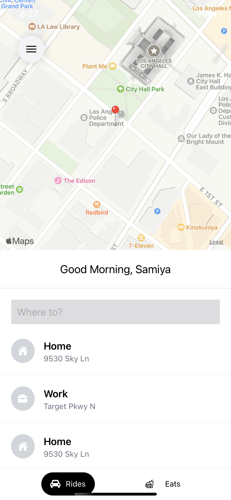

# react-native-UBER CLONE 💸

A sweet & simple react native UBER clone that features realtime fetching prices, location, and distance using the GoogleMaps API.

  
  
    
      
        
          
            
            <video width="320" height="240" controls>
      <source src="assets/images/UberVideo.mp4" type=video/mp4>
    </video>

## Features

React-Native

Redux

GoogleMaps API
